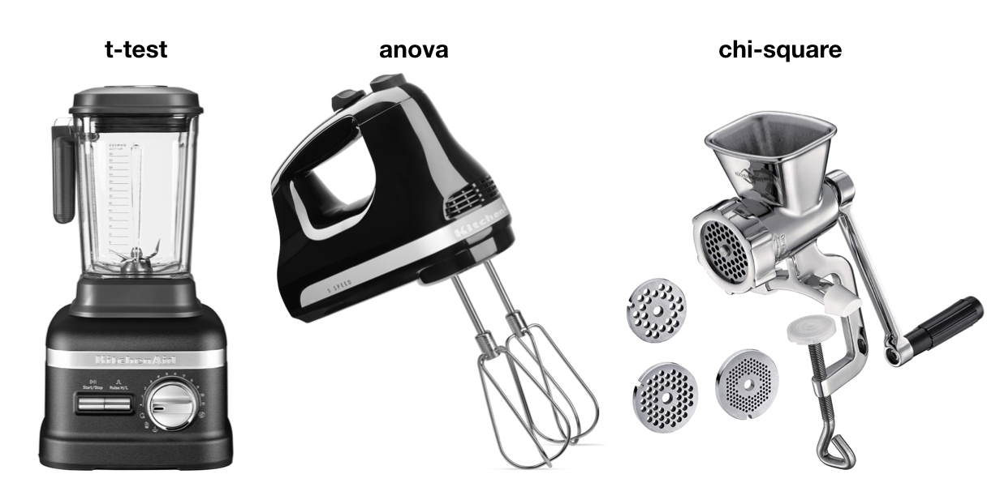
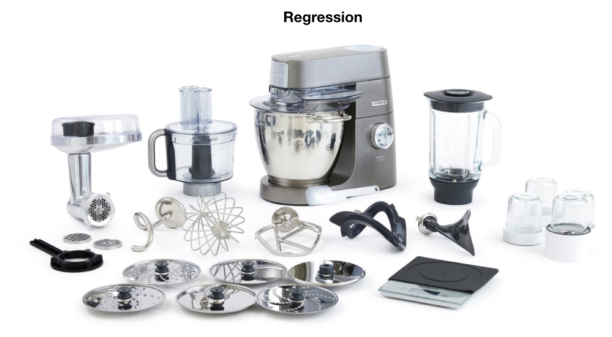
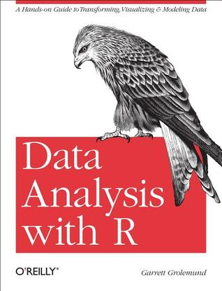
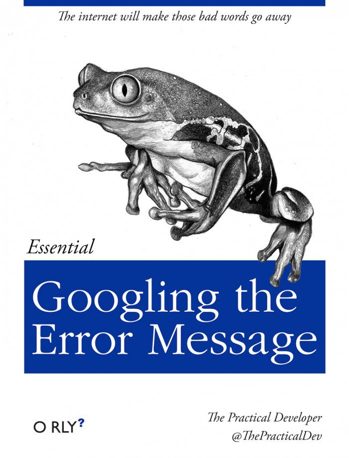
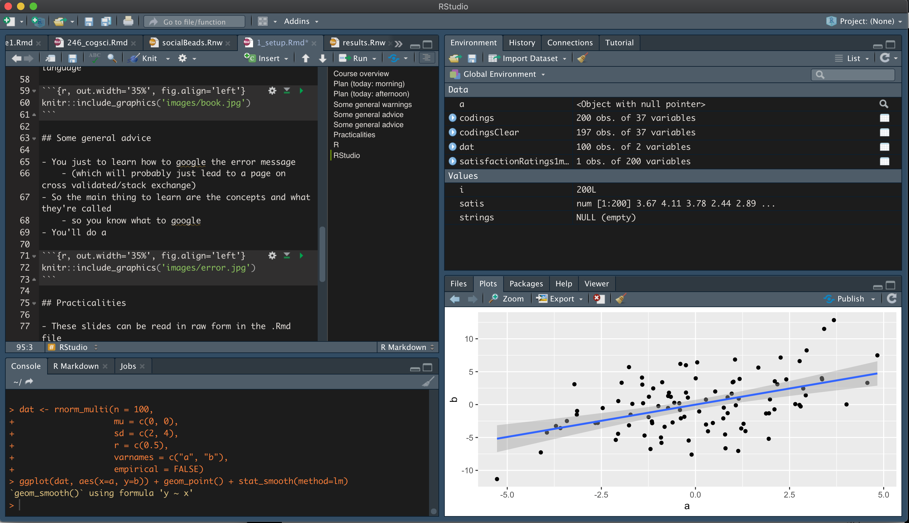

```{r setup, include=FALSE}
library(plotly)
library(knitr)
library(faux)
```

## Course overview {.build}

 - Intro to R + tidyverse + markdown
 - Communicating visually
 - Modeling data with regression
 
<div style="float: left; width:50%">
```{r, out.width='100%', echo=F}

```
</div>

<div style="float: right; width:50%">
```{r, out.width='100%', echo=F}

```
</div>

## Plan (today: morning)

- 9-10: Getting set up/R fundamentals
- 10-11: Introduction to the Tidyverse/data processing
- 11-12: Basics of regression (1)

## Plan (today: afternoon)

- 13-14: Basics of regression (2)
- 14-15: Communicating visually with ggplot
- 15-16: Adding complexity: interaction and quadratic terms
- 16-17: Putting it all together: project time

## Some general warnings 

> - This is a lot to cover in 2 days

> - We have a wide range of prior knowledge
>    - No question is a bad question
   
> - I'm aiming at intuitive explanations of the basic ideas

> - There are some explicit exercises **in bold**
>    - But you're encouraged to just play around with it/try stuff/see if anything breaks

## Some general advice

- You don't *need* to sit and learn a programming language

```{r, out.width='35%', fig.align='left', echo=F}

```

## Some general advice

<div style="float: left; width:50%">
```{r, out.width='100%', echo=F}

```
</div>

<div style="float: right; width:50%">
```{r, out.width='100%', echo=F}
include_graphics('images/changing-stuff.jpg')
```
</div>


```{r, out.width='30%', fig.align='left', echo=F}

```

## Practicalities

- These slides can be read in raw form in the .Rmd file
- They can be viewed in a nicer format in the .html file
- There are also exercises/projects in .Rmd format

## R

- R is a programming language
  - unlike SPSS, which is (mostly) point-and-click
  - need to type things **exactly**
- R is free
  - unlike Matlab/SPSS, which need a license
  - active community of package developers
- This makes for better science
  - Reproducible, flexible, open

## RStudio 

- RStudio is a user interface to R
- There is a free version 
- It makes it easier to do everything in one: 
  - fiddle around with code
  - explore the data
  - make plots
  - run whole analyses
  - produce lovely reports/slides/dashboards
  - share your work
  
## RStudio

```{r, out.width='100%', fig.align='left', echo=F}

```

## Basic R operations {.smaller}

Addition, subtraction,  multiplication, division
```{r}
1 + 2
2 - 3
3 * 4
4 / 5
```

## Assignment

```{r, error=TRUE}
a <- 3
b <- 2
a^b
b <- "hello"
a^b
```

## Vectors

```{r}
my_vector <- c(1, 2, 3)
2*my_vector
other_vector <- c(2, 3, 4)
my_vector*other_vector
```

## Ranges

```{r}
my_sequence <- 1:10
my_sequence
```

**How would you get numbers 0.1, 0.2, ... 1 instead?**

## Indexes {.smaller}

```{r}
f <- 1:10*10
f[2] <- 2000
f 
f[11] <- 999
f
```

**What happens if you try set e.g., the 15th index of this vector to something?**

**What happens if you try set the 3rd index to the letter 'z'?**

**How could you pull out the 2nd AND 5th index of this vector?**

## Data frames

Data frames consist of columns, each of which is a vector of values

```{r, eval=F}
my_vector <- c(...)
my_dataframe <- data.frame(...)
```


## Data frames

Data frames consist of columns, each of which is a vector of values

```{r}
my_data <- data.frame(
  animal = c("cat", "dog", "peacock"),
  legs = c(4, 4, 2)
)

my_data
```

**Try define the columns before creating the data frame**

## Get columns

```{r}
my_data$animal

my_data$legs
```


## New columns

```{r}
my_data$furry <- c(TRUE, TRUE, FALSE)
my_data$eyes <- 2
my_data
```

## Columns based on logic/boolean variables

```{r}
x <- c(1, 4, 8, 10)
x == 4 # Checks if x is 4
x %% 4 == 0
```

**Try add a boolean 'biped' column to my_data**

## Loading data

A simply, easy to use format for data is .csv

Menu: file > import dataset > from text (readr)

## Functions 

Functions are bits of code that do something: 
they take an input (argument) and produce an output

```{r}
a <- 1:100/100
mean(a)
max(a)
```

**Set the 102nd index of this vector to any number. Try run `mean` again. What happens?**

**Let's look for help by typing `?mean` in the console**

## Functions with multiple arguments

```{r}
round(a, 1)
round(mean(a), 1)
```

## Custom functions

```{r, eval=F}
function_name <- function(...){...}
```

## Custom functions

```{r, eval=F}
function_name <- function(input){
  ...do stuff...
  return(output)
}
```

## Custom functions

```{r}
inverse <- function(number){
  # return the inverse of a number
  number_inverse <- 1/number
  return(number_inverse)
}

inverse(3)
```

**Try break this function by doing something it doesn't expect.**

## Making functions more robust/informative {.smaller}

```{r, error=T}
inverse <- function(number){
  # return the inverse of a number
  # if not a number, return error
  if(is.numeric(number)){
    return(1/number)
  } else {
    stop("Input not a number!")
  }
}

inverse(3)
inverse("z")
```

**Make this even more robust by checking if the number is 0.**

## Packages

Fortunately, someone in the R community has probably already written a function for most of your needs. You just need to google for them.

Handy collections of such functions are called "packages".

If you want to use any of them in a session, you need to load them in the `library()`

```{r, eval=F}
install.packages("performance")
library(performance)
```

## Simulating data

- Sometimes we'll do exercises based on datasets I give you

- But sometimes we'll generate some fake random data. Why?
  - If means you know what information is going into the data
  - So you can check that you've done an analysis properly, by comparing it with what info you put in
  - It also means we can vary things, to see what happens/what changes
  
  

## Simulating single variables

Type `?rnorm` to get help.
  
```{r}
var1 <- rnorm(20, 5, 2)
var1
mean(var1)
sd(var1)
```

## Simulating independent variables

```{r}
set.seed(123)
tabby_cat_weight <- rnorm(15, 5, 2)
russian_blue_weight <- rnorm(15, 7, 3)

t.test(tabby_cat_weight, russian_blue_weight, var.equal=FALSE)
```

## Simulating correlated variables

Ensure you've loaded the `faux` library

```{r}
faux_data <- rnorm_multi(n = 100,
                  mu = c(0, 0),
                  sd = c(2, 3),
                  r = c(0.5),
                  varnames = c("A", "B"),
                  empirical = TRUE)
```

## Simulating correlated variables

```{r}
cor.test(faux_data$A, faux_data$B)
```

