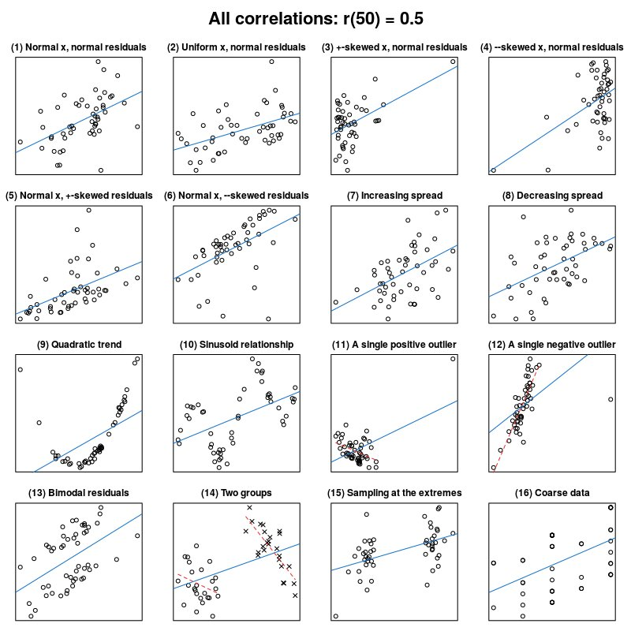
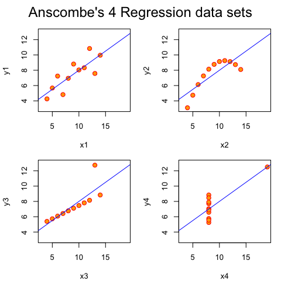

```{r setup, include=FALSE}
library(tidyverse)
library(plotly)
library(knitr)
library(faux)
theme_set(theme_bw())
```

## Concepts

Let's say we have two variables, height and weight.

We measure 100 people's height and weight.

Do you expect a relationship between height and weight in the data?

What kind of relationship? How would you describe it?

## Concepts

```{r, echo=F}
set.seed(123)
intercept <- 10
data <- data.frame(x=rnorm(50, 30, 5),
                   beta=rnorm(50, 3, 1),
                   error=rnorm(50, 0,1)) %>% 
  mutate(y=intercept + beta*x + error)

ggplot(data,aes(x=x,y=y)) + geom_point()
```

## Concepts

```{r, echo=F, warning=F, message=F}
ggplot(data,aes(x=x,y=y)) + 
  geom_point() + 
  stat_smooth(method=lm,
              se=F)
```

## Concepts

- How does *x* affect *y*? (simple regression)
- Given *x*, what value of *y* would you expect?
- Two main questions about estimated value of *y*:
    - What info goes into calculating it?
    - How close is this to the real value?

## Concepts

[https://justinsulik.shinyapps.io/linear_regression_demo/](https://justinsulik.shinyapps.io/linear_regression_demo/)

- Intercept
- Slope
- (Residual) error

## Concepts

- To be clear: this isn't what you feed into the regression. It's what the regression tells you, given some data

- y = intercept + b*x + e

- (we'll add some subtlety to this soon)

## How does it do that? A visual analogy

<video width="649" height="480" controls>
  <source src="images/ConventionalAnchoredGardensnake-mobile.mp4" type="video/mp4">
</video>

## How does it do that? More specific

*One* way: ordinary least squares

```{r, echo=F, warning=F, message=F, fig.height=4, fig.width=4}
data_least_sq <- data.frame(
  x = c(1, 2, 3),
  y = c(1.6, 1.6, 3.2)
)
mod <- lm(y~x, data_least_sq)

intercept <- coef(mod)[[1]]
beta <- coef(mod)[[2]]

point_on_line <- function(x,intercept,beta){
  yhat <- intercept + beta*x
  return(yhat)
}

p <- ggplot(data_least_sq,
       aes(x=x,y=y)) + 
  geom_point() + 
  geom_abline(intercept=intercept, 
              slope=beta,
              color="royalblue") + 
  theme(axis.title = element_blank(),
        axis.text = element_blank(),
        axis.ticks = element_blank()) +
  coord_cartesian(xlim=c(0.7,3.2), ylim=c(1, 3.5))

for(i in 1:nrow(data_least_sq)){
  x <- data_least_sq[i,]$x
  y <- data_least_sq[i,]$y
  yhat <- point_on_line(x, intercept, beta)
  side_length <- yhat-y
  p <- p + geom_rect(xmin=x, ymin=y, xmax=x+side_length, ymax=y+side_length, 
                     color="firebrick1",
                     fill="firebrick2",
                     alpha=0.2) +
           geom_segment(x=x, xend=x, 
                        y=y+side_length, yend=y,
                        color="black")
}

p

```

## Some simple examples - fake data

```{r}
faux_data <- rnorm_multi(varnames = c("outcome", "predictor"),
                  n = 100,
                  mu = c(0, 0),
                  sd = c(2, 3),
                  r = c(0.5),
                  empirical = TRUE)
```

What are you expecting the intercept to be? The beta/slope? 

## Some simple examples - fake data {.smaller}

```{r}
mod1 <- lm(outcome~predictor, faux_data)
summary(mod1)
```

**What would you tweak in the faux data to get a beta of 0.5?**

## Some simple examples - fake data

**Play around with the parameters for faux_data, to see how this affects the model output**

```{r, eval=F}
faux_data <- rnorm_multi(n = 100,
                  mu = c(0, 0),
                  sd = c(2, 3),
                  r = c(0.5),
                  varnames = c("outcome", "predictor"),
                  empirical = TRUE)

faux_data %>% 
  lm(outcome~predictor,data=.) %>% 
  summary

ggplot(faux_data,
  aes(x=predictor, y=outcome)) +
  geom_point() + 
  stat_smooth(method=lm)
```

## Do the specific numbers matter? {.smaller}

```{r, echo=F, message=F, warning=F}
#source: https://raw.githubusercontent.com/rmcelreath/rethinking/master/data/Howell1.csv"
weight_data <- read_csv("data/weight.csv") %>%  
  filter(age>20)
```

```{r}
lm(weight_kg~height_cm,weight_data) %>% summary
```

## Do the specific numbers matter? {.smaller}

```{r}
lm(weight_lbs~height_inches,weight_data) %>% summary
```

## Do the specific numbers matter?

<div style="float: left; width:50%">
```{r, out.width='100%', echo=F, warning=F, message=F}
weight_data %>% 
  filter(age>20) %>% 
  ggplot(aes(x=height_cm,y=weight_kg)) + 
  geom_point(alpha=0.4) + 
  stat_smooth(method=lm)
```
</div>

<div style="float: right; width:50%">
```{r, out.width='100%', echo=F, warning=F, message=F}
weight_data %>% 
  filter(age>20) %>% 
  ggplot(aes(x=height_inches,y=weight_lbs)) + 
  geom_point(alpha=0.4) + 
  stat_smooth(method=lm)
```
</div>

## What about the t & p values?

Go check the two models. See what changes vs. stays the same.

beta: sensitive to scale of variables?

std. error: sensitive to scale of variables?

**What about their ratio? manually calculate beta/se**

## Changing your data without changing your conclusions {.smaller}

```{r}
cor.test(weight_data$height_cm, weight_data$weight_kg)
```

## Changing your data without changing your conclusions {.smaller}

**let's take a moment to see what `scale()` does**

```{r}
weight_data %>% 
  mutate_if(is.numeric, scale) %>% 
  lm(weight_kg ~ height_cm,data=.) %>% 
  summary
```

## Changing your data without changing your conclusions {.smaller}

- Why was the intercept negative?
- What do you think the intercept means below?

```{r}
weight_data %>% 
  mutate(height_cm = scale(height_cm, scale=FALSE)) %>% 
  lm(weight_kg~height_cm,.) %>% 
  summary
```

## Am I doing this right?

- Always plot your data

```{r, out.width='60%', echo=F}

```

## Am I doing this right?

- Always plot your data

```{r, out.width='50%', echo=F}

```

## Assumptions {.smaller}

1: the relationship between outcome and predictor(s) is assumed to be linear

2: the residuals are normally distributed

3: the residuals have a constant variance

4: the residuals are independent

Some of these can be read off plots; others need thinking about

## Assumptions 1: are we looking at a linear relationship? {.smaller}

- Should see: flat horizontal line

```{r, fig.height=3}
plot(mod1, which=1)
```

## Assumptions 2: Are the residuals normally distributed? {.smaller}

Common myth: the outcome must be normally distributed.
False! the residuals must be normally distributed.

```{r, fig.height=3}
data.frame(residuals = resid(mod1)) %>% 
  ggplot(aes(x=residuals)) + 
  geom_density()
```

## Assumptions 2: Are the residuals normally distributed? {.smaller}

Common myth: the outcome must be normally distributed.
False! the residuals must be normally distributed.

```{r, fig.height=3}
plot(mod1, which=2)
```

## Assumption 4: the residuals are independent

This needs thinking about

How could the residual for one data point be related to the residual for another data point?

## Next up

- Today:
    - What about categorical predictors?
    - Multiple predictors?
    - Easy cases of non-linearity.

- Tomorrow:
    - More problematic cases of non-linearity
    - What to do if there's a serious problem with non-normality?
    - What to do if residuals aren't independent?

